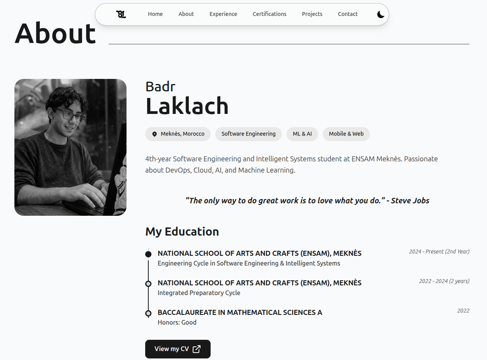

# Badr Laklach – Portfolio

  

  
  

## About

Software Engineering and Intelligent Systems student at ENSAM-Meknès (2022-2027), building applied AI, cloud-native, full-stack, mobile, and XR products.

Highlighted work includes HawQ-ai XR relocalization, DokuMind enterprise knowledge management, Agile Microservices, DariPredictor, XP-FIT, and a smart-office IoT simulation.

## Technical Stack

- **Framework**: Next.js 16 (App Router)
- **Language**: TypeScript
- **Styling**: Tailwind CSS 4
- **Animations**: Three.js (React Three Fiber)
- **UI Components**: Radix UI (shadcn/ui)
- **i18n**: Automatic French/English browser detection
- **Deployment**: GitHub Pages

## Core Features

- **3D Animations**: Interactive background effects powered by Three.js
- **Bilingual Interface**: Full FR/EN support based on browser preferences
- **Responsive Architecture**: Fully optimized for mobile, tablet, and desktop viewports
- **Dark/Light Mode**: Adaptive theming with user persistence
- **Direct Contact CTA**: Static, zero-dependency email integration
- **SEO Optimization**: Comprehensive metadata, semantic HTML, robots.txt, and JSON-LD
- **Legal Compliance**: Mentions légales and privacy policy pages included

## Featured projects

- **HawQ-ai XR / MRAF** — Unity and Meta Quest 3 workflow for digital-twin visualization, Scene Understanding, and multi-zone spatial relocalization.
- **DokuMind** — Collaborative multi-tenant knowledge-management SaaS with PDF ingestion, semantic retrieval, reranking, grounded answers, and streaming chat.
- **Agile Microservices** — Agile workspace built with Spring Boot services, API Gateway, JWT, RabbitMQ, PostgreSQL, MongoDB, React, Docker, and Kubernetes.
- **DariPredictor** — Moroccan real-estate valuation platform with data ingestion, ensemble ML, FastAPI, React/Vite, mapping, and Docker.
- **XP-FIT** — Gamified Flutter fitness and nutrition application.
- **Smart Office IoT** — Cisco Packet Tracer network and automation simulation with sensors, RFID access control, safety, and energy-aware logic.

## Current project focus

- **Applied AI and RAG**: document ingestion, semantic retrieval, reranking, grounded generation, and real-estate prediction.
- **XR and digital twins**: Unity, Meta Quest 3, Scene Understanding, and spatial relocalization.
- **Cloud-native systems**: Spring Boot microservices, API gateways, RabbitMQ, PostgreSQL, MongoDB, Docker, and Kubernetes.

## Internationalization

The platform automatically detects the browser's language:
- French (FR) if the browser is set to French
- English (EN) serves as the default fallback for all other cases

Translations are managed via `lib/translations.ts` and an injected `useLanguage()` custom hook.

## Live Deployment

**Website URL**: [https://badrlaklach.github.io/my-portfolio/](https://badrlaklach.github.io/my-portfolio/)

The portfolio is deployed to GitHub Pages and updates automatically on pushes to the `main` branch.

## Legal Pages

- [Mentions Légales](https://badrlaklach.github.io/my-portfolio/mentions-legales)
- [Privacy Policy](https://badrlaklach.github.io/my-portfolio/politique-confidentialite)

## Author

- **Badr Laklach**
- [LinkedIn Profile](https://www.linkedin.com/in/badrlaklach/)
- [GitHub Profile](https://github.com/BadrLaklach)

---

© 2026 Badr Laklach. All rights reserved.
