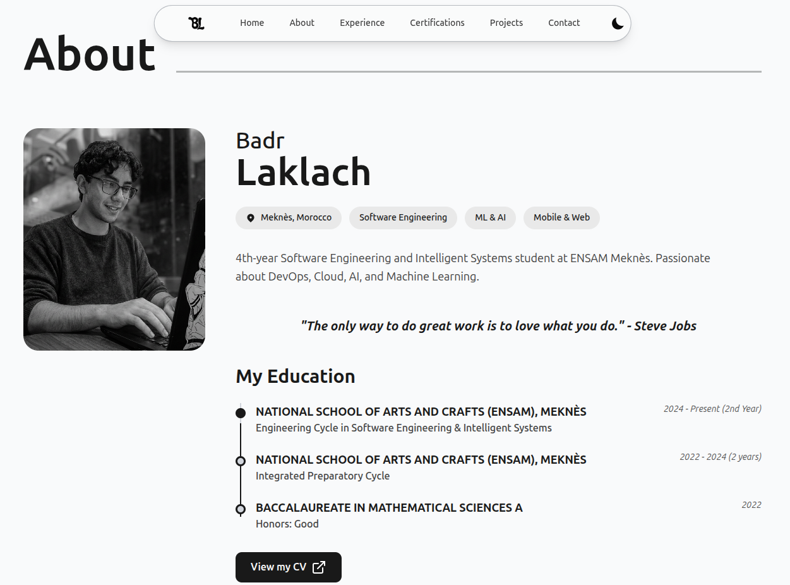

# Hi there 👋 I'm Badr Laklach

  
   
  <i>Welcome to my GitHub! Explore my projects, contributions, and technical journey.</i>

 

## 👨‍💻 About Me

I am a 4th-year **Software Engineering and Intelligent Systems** student at **ENSAM Meknès** in Morocco. I am deeply passionate about architecting robust software solutions, leveraging data through AI and Machine Learning, and building scalable applications for web and mobile platforms. 

- 🌱 I’m currently diving deeper into **Cloud Architecture**, **DevOps pipelines**, and **Advanced Flutter development**.
- 💼 Check out my [Live Portfolio](https://badrlaklach.github.io/my-portfolio/) to see my complete professional experience, certifications, and interactive project demos.
- 📫 How to reach me: [badrlaklach27@gmail.com](mailto:badrlaklach27@gmail.com)

## 🛠️ Technical Arsenal

### Languages & Frameworks
- **Frontend**: React, Next.js, Tailwind CSS, TypeScript
- **Backend**: Python (FastAPI), Java (Spring Boot)
- **Mobile**: Flutter, Dart, GetX
- **Data & AI**: Machine Learning, Scikit-Learn, Pandas

### Cloud & DevOps
- Oracle Cloud Infrastructure (OCI)
- Docker
- Git & GitHub Actions
- Supabase / PostgreSQL

## 🏆 Certifications & Highlights

- **Oracle Cloud Infrastructure 2025 Certified Data Science Professional**
- **Oracle Cloud Infrastructure 2025 Certified Foundations Associate**
- **PCEP – Certified Entry-Level Python Programmer**

## 🌐 Connect with Me

  
  

---
*This README is completely standalone. Feel free to copy its contents alongside the images in this folder to your main `BadrLaklach/BadrLaklach` repository to set up your GitHub profile!*
